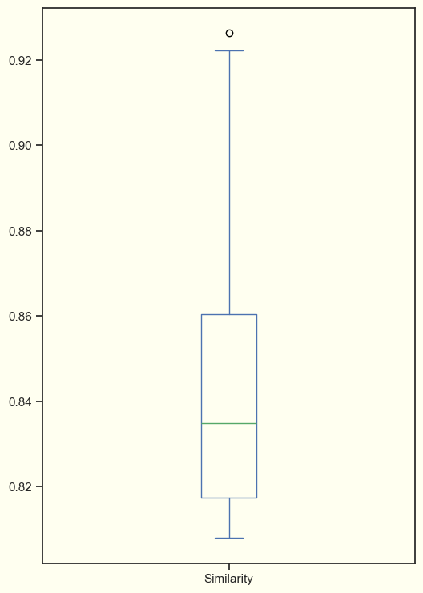
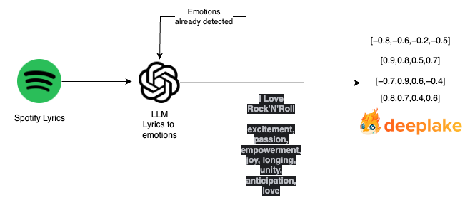
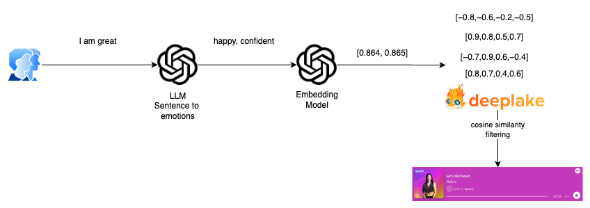

# Exploring Machine Learning for Personalized Music Recommendations

Hello, fellow machine learning enthusiasts! 

After several years of working as a Data Engineer, I've embarked on a new journey to delve into the diverse
realms of machine learning. This article marks the beginning of my exploration through various projects aimed at learning
and understanding this fascinating field. While I may be starting with Large Language Models (LLMs), I view it as an initial
step to ignite my passion and motivation for this new endeavor. Join me as I dive into the world of machine learning,
eager to expand my knowledge and skills. Let's embark on this journey together!

## Introduction

In the past few weeks, I enrolled in a course by [ActiveLoop](https://learn.activeloop.ai/courses/langchain) (Thank Diego for 
the recommendation) to gain insights into Large Langauge Models (LLMs) and understand this burgeoning field better.
In essence, a Large Language Model is an advanced artificial intelligence system designed to understand and generate 
human-like text.

After completing the course, I delved into a specific lesson on constructing a 
[Song Recommendation System](https://www.activeloop.ai/resources/3-ways-to-build-a-recommendation-engine-for-songs-with-lang-chain/).
I found it to be an excellent starting point for developing a similar system from scratch.

The concept is to construct a music recommendation system leveraging [DeepLake](https://www.deeplake.ai/) 🚀 
and [LangChain](https://python.langchain.com/en/latest/index.html) 🦜⛓ technologies.
DeepLake serves as a vector store tailored for LLM apps, The objective is to enhance recommendation accuracy
by employing LLM capabilities rather than directly querying embedded documents, thus refining the recommendation process.

Let's break down the whole process of creating [EmotiTuneOT](https://github.com/NachoCP/EmotiTuneOT) (maybe not the best name 😅)
a web application to recommend songs based on user input emotions. Our objective is straightforward: to understand
the user's mood and provide a song recommendation that resonates with that emotion.

Let's get this show on the road!

## Underlying concepts

Vector embeddings are numerical representations of various entities such as objects, documents, images, audio files, 
and more, within a continuous vector space. This mathematical representation aims to capture the semantic meaning of these entities. 
The "dimensionality" of the vector represents the total number of features or attributes encoded. Meanwhile, the position
of the vector reflects the relationship with other entities in the vector space. Embeddings are normally
generated by AI models.

To effectively compare these embeddings and look for similarity between them, search algorithms play a crucial role.
Among them, cosine similarity is a particular important concept. Cosine similarity determines how similar or different
are two vectors in terms of direction using the angle between them in their vector space. By using
cosine similarity, systems can perform similarity searches which is foundational for recommendation systems.

Vector databases utilize these embeddings to store and organize data efficiently. By representing data as vectors, 
vector databases enable machine learning models to easily access and manipulate the data for various tasks such as 
similarity search, recommendation systems, and text generation. The embeddings stored in the vector database serve 
as a compact and meaningful representation of the original data, facilitating faster and more accurate processing 
by machine learning algorithms.


## Data Collection

This year, my wife and I have been avidly following a Spanish music reality show, "Operación Triunfo". 
I made the decision to utilize their lyrics as the dataset for our project, opting for a more culturally relevant 
source compared to the Disney lyrics initially considered. I have used the following list from Spotify `https://open.spotify.com/playlist/37i9dQZF1DWZYJ3pS3pteL?si=4481b20beab24def`,
which contains all the songs related to this year's edition.

I utilized two primary libraries to scrape all the songs from the playlist:

- [Spotipy](https://spotipy.readthedocs.io/en/2.22.1/): for extracting metadata such as name of the songs, artist, lyrics, spotify URL, etc.
- [LyricsGenius](https://lyricsgenius.readthedocs.io/en/master/): a Python client for the Genius.com API, which host all the songs lyrics.

The process is straightforward: retrieve all tracks from the playlist with Spotipy and then fetch all the lyrics using the Genius API. 
The results are the following **[json](https://github.com/NachoCP/EmotiTuneOT/blob/main/data/ot-tracks.json)**.
```json
{
   "name":"Historias Por Contar",
   "spotify_track_url":"https://open.spotify.com/track/7HmviR8ziPMKDWBmdYWIFA",
   "spotify_api_track_url":"https://api.spotify.com/v1/tracks/7HmviR8ziPMKDWBmdYWIFA",
   "popularity":66,
   "uri":"spotify:track:7HmviR8ziPMKDWBmdYWIFA",
   "release_date":"2024-02-19",
   "lyrics":"Solo hace falta creer Y que se caiga el mundo Solo hace falta sentir Hasta quedarnos mudos (Oh) Ya no hace falta decirnos nada Si me lo cuentas con la mirada Donde sea que est\u00e9 Yo te guardo un caf\u00e9 Que nos haga recordar  Que como agua de mar Somos la ola que suena al chocar (Oh-oh) Ll\u00e1malo casualidad Pero esto se convirti\u00f3 en un hogar (Nuestro hogar) Y en las paredes quedar\u00e1n nuestros nombres En los rincones sonar\u00e1n nuestras voces Y el resto son historias por contar  Explotamos de emoci\u00f3n Hasta quedarnos sin aliento P\u0435rdiendo noci\u00f3n de todo De c\u00f3mo pasaba \u0435l tiempo S\u00edrvame una ronda m\u00e1s Ya no importa el qu\u00e9 dir\u00e1n (Nadie apaga nuestro foco) (Hoy al fin estamos todos) J\u00f3venes como la noche Que nos vengan a parar (Nadie apaga nuestro foco) (Ya ma\u00f1ana empieza todo) You might also like Oh, oh, oh Eh, eh Oh, oh, oh Oh, oh, oh Que ma\u00f1ana empieza todo Que ma\u00f1ana empieza todo  Que como agua de mar Somos la ola que suena al chocar (Al chocar, al chocar) Ll\u00e1malo casualidad Pero esto se convirti\u00f3 en un hogar (Nuestro hogar) Y en las paredes quedar\u00e1n nuestros nombres En los rincones sonar\u00e1n nuestras voces (Uh) Y el resto son historias por contar Y el resto son historias por contar Que como agua de mar Somos la ola que suena al chocar (Al chocar, al chocar, oh, oh) Ll\u00e1malo casualidad Pero esto se convirti\u00f3 en un hogar (Nuestro hogar) Y en las paredes quedar\u00e1n nuestros nombres En los rincones sonar\u00e1n nuestras voces (Nuestras voces) Y el resto son historias por contar  Y el resto son historias por Y el resto son historias por contarEmbed"
}
```

## Vector embedding strategy

Once we have got all our music data, the next thing on the agenda is figuring out the best strategy
for representing this data to build the music recommendation system.
The [article](https://www.activeloop.ai/resources/3-ways-to-build-a-recommendation-engine-for-songs-with-lang-chain/) 
details various methods to achieve these embeddings. Here’s the rundown:

1. **Similarity Search Over the Lyrics**: The first method generates embeddings for both the song 
lyrics and user inputs, aiming for matches based on cosine similarity. While straightforward, 
this approach yielded suboptimal results. The similarity scores for recommended songs consistently 
fell below 0.735, indicating a notable disconnect from anticipated outcomes.

2. **Similarity Search Over Emotion Embeddings**: To overcome the shortcomings of the lyric-based approach, 
this method adopts a more refined strategy. It converts lyrics into a set of eight emotions using ChatGPT, 
then performs similarity searches against these emotion profiles. This approach led to more precise and contextually 
relevant song recommendations. Utilizing custom ChatGPT prompts to translate songs and user inputs into emotional 
descriptors significantly improved the quality of matches. The similarity scores saw an uptick, averaging around 0.83, 
which better meets the users' emotional needs.

These strategies illustrate the progression from a straightforward lyric similarity search to a more sophisticated 
emotion-based matching system, demonstrating the importance of nuanced analysis in improving recommendation accuracy.

Building on these insights, a critical observation was made regarding the emotion-based approach. 
The emotions used to represent the songs often include derivative terms from the same song, such as "betrayal" and "betrayed". 
The new approach involves passing the list of emotions already extracted in each iteration when extracting emotions from the lyrics.
By doing so we avoid the addition of any modified terms and ensuring consistency within the emotion representation. 
This adjustment aims to enhance the accuracy and relevance of the song recommendations by fine-tuning the emotional 
context captured for each song.

Specifically, we reduced the set of emotions from an initial count of 258 down to 108.
This reduction represents a significant improvement, resulting in a remarkable decrease of 
approximately 58.14% in the number of emotions employed for song classification. 

As a result, the songs retrieved using this new strategy exhibit remarkable improvements. Notably, 
some songs that were previously overlooked in the initial approach now surface among the 
recommendations. This enhancement is attributed to the refined emotion representation, 
which has yielded more accurate results.

```
La Cigarra: 0.9262899160385132
When The Party's Over: 0.9222339391708374
Without You: 0.9132721424102783
Para No Verte Más: 0.9083424210548401
Ya No Te Hago Falta: 0.8897972106933594
Peces De Ciudad: 0.8882670998573303
El Fin Del Mundo: 0.8868305087089539
Me Muero: 0.8862753510475159
Se Fue: 0.885942280292511
Way Down We Go: 0.8858000040054321
```

Furthermore, our analysis of the box plot graph reveals a notable increase in the similarity scores, 
indicating a more refined selection of appropriate songs. This improvement underscores the effectiveness
of our updated strategy in enhancing the recommendation process.



Now that we have all the data and the embedding strategy, it's time to dive into constructing the recommendation system. 

## Recommendation system

First things first, let's get our data stored. As mentioned earlier, we're tapping into DeepLake as our go-to vector 
store for those vector embeddings. Thanks to Langchain, there’s a handy DeepLake implementation that lets us plug in 
our Embedding model as a parameter. This setup makes generating embeddings super straightforward and intuitive. 
All you've got to do is supply the features, and voilà – your dataset will be all set up with the embeddings neatly stored 
in the vector store.

The plan is to process the text and leverage the other attributes as metadata. For this, I've utilized the 
OpenAIEmbeddings implementation in Langchain, specifically **"text-embedding-ada-002"**. This choice was influenced by its 
use in the provided example. Moving forward, I'm keen on exploring various embedding techniques in future articles.

As outlined in our embedding strategy, we plan to capture the emotions from the lyrics through embeddings. 
To accomplish this, we'll be utilizing ChatGPT alongside a custom prompt. Moreover, in every iteration, we will identify 
and extract the emotions previously used and incorporate them into the prompt. This step ensures we sidestep any 
derivative terms, keeping our emotion extraction precise and relevant.

This is the prompt used:

```
"""
Think that you are an expert in translating emotions from song lyrics and names.
The songs are going to be in Spanish and English but the emotions should be only in English.
Giving the following song {name} and its lyrics:

{lyrics}

Please provide eight emotions that can describe the song separated by a comma, all lower and without any other special character.
These emotions have been already used for some songs, please avoid using derivative terms from them such as "betrayal or betrayed"
{emotions_used}
"""
```

The song **I Love Rock'N'Roll"**, iconic from the 80s get the following set of emotions 
**"excitement, passion, empowerment, joy, longing, unity, anticipation, love"**.

The full processing for storing the lyrics is described in the following diagram.



Now, we have to convert the user's sentence to a set of emotions that could cover the representation. We used another custom
prompt for performing this action:
```
"""
Think that you are an expert in translating emotions from sentences.
We have a song retrieval system which will have for each song a set of 8 emotions.

For the following sentence

 {sentence}

Please provide the emotions/feelings or impressions that are giving you this sentence.
You don't need to fulfill the list of 8 emotions if you don't consider it.
Please provide them separated with a comma and lower. All the emotions should be in English.
"""
```

For the song retrieval phase, our system employs a two-step filtering process to ensure users are presented with 
songs that not only match their emotional input but are also likely to appeal to their musical tastes. Initially, 
we filter out songs that fail to meet a predefined similarity threshold. This threshold is crucial as it helps us 
maintain a high standard of relevance, ensuring that only songs with a strong emotional resonance with the user's
input are considered.

Once we have a filtered list of emotionally resonant songs, we proceed to the next step of our selection process, 
which involves leveraging Spotify's "popularity" metric. This metric, provided by the Spotify API, gauges the current 
popularity of tracks on the platform, taking into account factors like play counts and recent trends in listening behavior.
By sorting the emotionally matched songs by their "popularity," we aim to not only align the recommendations with the 
user's emotional state but also to ensure that the songs are among those currently enjoyed by a wider audience. 
This method strikes a balance between emotional accuracy and musical relevance, offering users songs that are both 
emotionally fitting and widely appreciated.



## Conclusion


In this journey, we've explored various approaches and methodologies to enhance the accuracy and relevance
of song suggestions. The realm of machine learning is vast and ever-expanding, offering endless opportunities 
for innovation and advancement. By embracing the possibilities presented by LLMs and other emerging technologies,
we can continue to push the boundaries of what's possible, creating more intelligent, intuitive, and impactful solutions 
for the future.


Looking forward to starting the new project!
