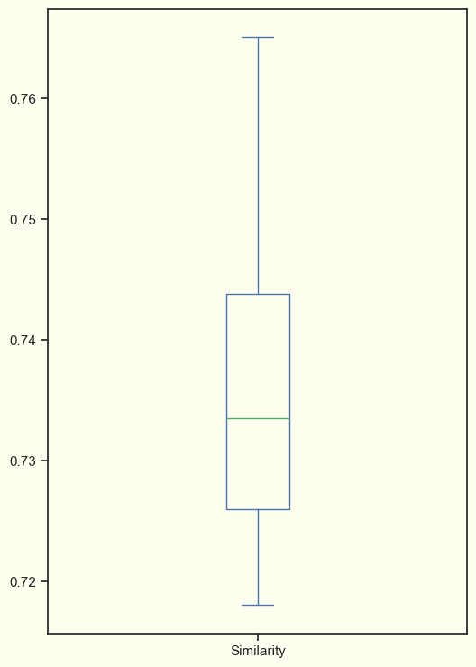
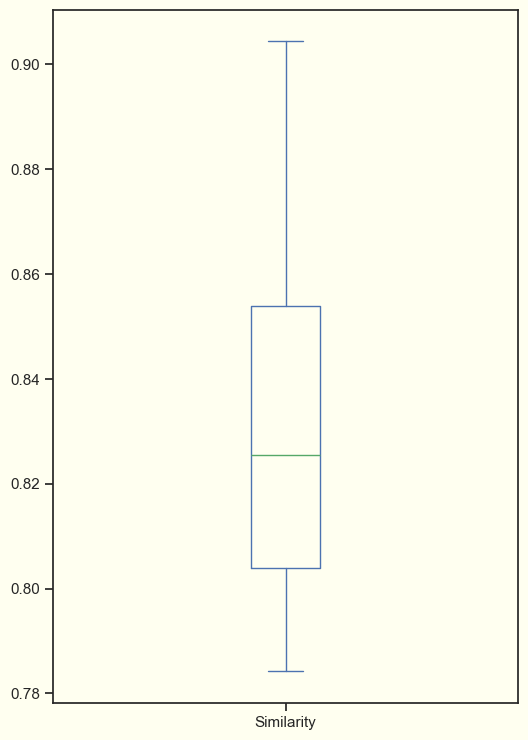

# Exploring Machine Learning for Personalized Music Recommendations

Hello fellow machine learning enthusiasts! 

After several years of working as a Data Engineer, I've embarked on a new journey to delve into the diverse
realms of machine learning. This article marks the beginning of my exploration through various projects aimed at learning
and understanding this fascinating field. While I may be starting with Large Language Models (LLMs), I view it as an initial
step to ignite my passion and motivation for this new endeavor. Join me as I dive into the world of machine learning,
eager to expand my knowledge and skills. Let's embark on this journey together!

## Introduction

In the past few weeks, I enrolled in a course by [ActiveLoop](https://learn.activeloop.ai/courses/langchain) (Thank Diego for 
the recommendation) to gain insights into Large Langauge Models (LLMs) and understand this burgeoning field better.
In essence, Large Language Models is an advanced artificial intelligence system designed to understand and generate 
human-like text.

After completing the course, I delved into a specific lesson on constructing a 
[song recommendation system](https://www.activeloop.ai/resources/3-ways-to-build-a-recommendation-engine-for-songs-with-lang-chain/).
I found it to be an excellent starting point for developing a similar system from scratch.

The concept is to construct a music recommendation system leveraging [DeepLake](https://www.deeplake.ai/) 🚀 
and [LangChain](https://python.langchain.com/en/latest/index.html) 🦜⛓ technologies.
DeepLake serves as a vector store tailored for LLM apps, The objective is to enhance recommendation accuracy
by employing LLM capabilities rather than directly querying embedded documents, thus refining the recommendation process.

Let's break down the whole process of creating [EmotiTuneOT](https://github.com/NachoCP/EmotiTuneOT) (maybe not the best name 😅)
a web application to recommend songs based on user input emotions. Our objective is straightforward: to understand
the user's mood and provide a song recommendation that resonate with that emotion.

Let's get this show on the road!

## Data Collection and Storing

This year, my wife and I have been avidly following a Spanish music reality show, "Operación Triunfo". 
I made the decision to utilize their lyrics as the dataset for our project, opting for a more culturally relevant 
source compared to the Disney lyrics initially considered. I have used the following list from Spotify `https://open.spotify.com/playlist/37i9dQZF1DWZYJ3pS3pteL?si=4481b20beab24def`,
which contains all the songs related to this year edition.

I utilized two primary libraries to scrape all the songs from the playlist:

- [Spotipy](https://spotipy.readthedocs.io/en/2.22.1/): for extracting metadata such as name of the songs, artist, lyrics, spotify URL, etc.
- [LyricsGenius](https://lyricsgenius.readthedocs.io/en/master/): a Python client for the Genius.com API, which host all the songs lyrics.

The process is straightforward: retrieve all tracks from the playlist with Spotipy and then fetch all the lyrics using the Genius API. 
The results are the following **[json](https://github.com/NachoCP/EmotiTuneOT/blob/main/data/ot-tracks.json)**.
```json
{
   "name":"Historias Por Contar",
   "spotify_track_url":"https://open.spotify.com/track/7HmviR8ziPMKDWBmdYWIFA",
   "spotify_api_track_url":"https://api.spotify.com/v1/tracks/7HmviR8ziPMKDWBmdYWIFA",
   "popularity":66,
   "uri":"spotify:track:7HmviR8ziPMKDWBmdYWIFA",
   "release_date":"2024-02-19",
   "lyrics":"Solo hace falta creer Y que se caiga el mundo Solo hace falta sentir Hasta quedarnos mudos (Oh) Ya no hace falta decirnos nada Si me lo cuentas con la mirada Donde sea que est\u00e9 Yo te guardo un caf\u00e9 Que nos haga recordar  Que como agua de mar Somos la ola que suena al chocar (Oh-oh) Ll\u00e1malo casualidad Pero esto se convirti\u00f3 en un hogar (Nuestro hogar) Y en las paredes quedar\u00e1n nuestros nombres En los rincones sonar\u00e1n nuestras voces Y el resto son historias por contar  Explotamos de emoci\u00f3n Hasta quedarnos sin aliento P\u0435rdiendo noci\u00f3n de todo De c\u00f3mo pasaba \u0435l tiempo S\u00edrvame una ronda m\u00e1s Ya no importa el qu\u00e9 dir\u00e1n (Nadie apaga nuestro foco) (Hoy al fin estamos todos) J\u00f3venes como la noche Que nos vengan a parar (Nadie apaga nuestro foco) (Ya ma\u00f1ana empieza todo) You might also like Oh, oh, oh Eh, eh Oh, oh, oh Oh, oh, oh Que ma\u00f1ana empieza todo Que ma\u00f1ana empieza todo  Que como agua de mar Somos la ola que suena al chocar (Al chocar, al chocar) Ll\u00e1malo casualidad Pero esto se convirti\u00f3 en un hogar (Nuestro hogar) Y en las paredes quedar\u00e1n nuestros nombres En los rincones sonar\u00e1n nuestras voces (Uh) Y el resto son historias por contar Y el resto son historias por contar Que como agua de mar Somos la ola que suena al chocar (Al chocar, al chocar, oh, oh) Ll\u00e1malo casualidad Pero esto se convirti\u00f3 en un hogar (Nuestro hogar) Y en las paredes quedar\u00e1n nuestros nombres En los rincones sonar\u00e1n nuestras voces (Nuestras voces) Y el resto son historias por contar  Y el resto son historias por Y el resto son historias por contarEmbed"
}
```

Once all the music data was downloaded, the next step was to create the dataset for retrieving our song. Embedding,
in the context of natural language processing, refers to represent words or text in a continuous vector space, and it will enable similarity
search for our system. By utilizing the LangChain implementation of DeepLake, this task became straightforward and intuitive. 
Simply by providing the text and the embedding model, the dataset could be generated in a matter of minutes. 

The idea is to process the text and use the other attributes as metadata. The embedding model used is the OpenAIEmbeddings implementation 
in Langchain ("text-embedding-ada-002"). I have used it as it was the one provided in the example, maybe for future articles I will
explore different embedding techniques.

## Recommendation


Now that we have all the data prepped and set, it's time to dive into constructing the recommendation system. 
The initial two approaches closely resemble those outlined in the ActiveLoop article; however, 
they've been adapted to suit my implementation. The third approach is a refinement of the second one,
enhancing its effectiveness. With these strategies in place, we're poised to create a robust recommendation 
system tailored to our needs.

### Similarity search over the lyrics

This approach followed a straightforward path: generating embedding for both the song lyrics and user input using GPT-3.
However, despite its simplicity, the results obtained were very pour and it didn't fit properly.

```python
results = db.similarity_search_with_score("I am very sad", distance_metric="cos", k=100)
```

Upon examining the most recent song recommendations, it's apparent that the outcomes do not 
match our expectations.

```
Without You: 0.7650831341743469
A Song For You: 0.7598393559455872
You Oughta Know: 0.7575978636741638
Sobreviviré: 0.7565886378288269
Make You Feel My Love: 0.7552418112754822
Believe: 0.7544375061988831
La Vida Moderna: 0.7540721297264099
High: 0.7522005438804626
Dígale: 0.7513208389282227
Se Acabó: 0.7512378692626953
```

The provided data indicates that the similarity scores for the songs 
are consistently below **0.735**. This discrepancy suggests that our recommendation system may 
not be effectively capturing the desired criteria for song selection. Utilizing a box plot 
visualization can offer further insights into the distribution of similarity scores and 
help pinpoint areas for improvement in our recommendation algorithm.



### Similarity search over emotions embedding

Given the inherent ambiguity of conducting a similarity search against all the lyrics, 
reducing the search space is likely to yield improved results. One strategy involves transforming each set of lyrics 
into a list of 8 emotions using ChatGPT, then performing similarity comparisons against these emotion representations. 
This approach aims to provide more focused and relevant song recommendations tailored to the user's emotional context. 

The prompt for ChatGPT to generate the emotion representation is as follows:

```
"""
Think that you are an expert in translating emotions from songs lyrics and names.
The songs are going to be on spanish and english but the emotions should be only in English.
Giving the following song {name} and its lyrics:

{lyrics}

Please provide eight emotions that can describe the song separated by a comma, all lower and without any other special character.
"""
```

The song **I Love Rock'N'Roll"**, iconic from the 80s get the following set of emotions 
**"excitement, enthusiastic, joy, energy, rebellion, passion, empowerment, nostalgia"**.

Now, we have to convert user's sentence to a set of emotions that could cover the representation. We used another custom
prompt for perfomring this action:
```
"""
Think that you are an expert in translating emotions from sentences.
We have a song retrieval system which will have for each song a set of 8 emotions.

For the following sentence

 {sentence}

Please provide the emotions/feeling or impressions that is giving you this sentence.
You don't need to fulfill the list of 8 emotions if you don't consider it.
Please provide them separated with a comma and lower. All the emotions should be in English.
"""
```

Upon analyzing the outcomes from the second approach, it's evident that the similarity scores 
have significantly increased, resulting in more precise song recommendations. 

```
Without You: 0.9043761491775513
El Fin Del Mundo: 0.9027754068374634
Ya No Te Hago Falta: 0.8940824270248413
Para No Verte Más: 0.8839386701583862
When The Party's Over: 0.8832711577415466
Alors On Danse: 0.8827184438705444
Zombie: 0.8802223801612854
Quiero Decirte: 0.8787371516227722
Young Hearts Run Free: 0.8739047050476074
Tómame O Déjame: 0.8730125427246094
```

The provided data indicates that the similarity scores for the songs now range around 0.83. 
This improvement suggests that our refinement of the recommendation algorithm has led to 
better-aligned results with our desired criteria.



### Third Approach:

Finally, I observed that the emotions used to represent the songs often include derivative terms from the same song, 
such as "betrayal" and "betrayed". To address this, I made a modification to the prompt.

The new approach involves passing the list of emotions already extracted in each iteration when extracting emotions 
from the lyrics. By doing so, we provide the LLM model with the set of emotions already utilized, 
thereby avoiding the addition of any modified terms and ensuring consistency within the emotion representation.

This was the prompt used:
```
"""
Think that you are an expert in translating emotions from songs lyrics and names.
The songs are going to be on spanish and english but the emotions should be only in English.
Giving the following song {name} and its lyrics:

{lyrics}

Please provide eight emotions that can describe the song separated by a comma, all lower and without any other special character.
These emotions has been already used for some songs, please avoid to do derivative terms from them such as "betrayal or betrayed"
{emotions_used}
"""
```

Specifically, we reduced the set of emotions from an initial count of 258 down to 108.
This reduction represents a significant improvement, resulting in a remarkable decrease of 
approximately 58.14% in the number of emotions employed for song classification. 

As a result, the songs retrieved using this new strategy exhibit remarkable improvements. Notably, 
some songs that were previously overlooked in the initial approach now surface among the 
recommendations. This enhancement is attributed to the refined emotion representation, 
which has yielded more accurate results.

```
La Cigarra: 0.9262899160385132
When The Party's Over: 0.9222339391708374
Without You: 0.9132721424102783
Para No Verte Más: 0.9083424210548401
Ya No Te Hago Falta: 0.8897972106933594
Peces De Ciudad: 0.8882670998573303
El Fin Del Mundo: 0.8868305087089539
Me Muero: 0.8862753510475159
Se Fue: 0.885942280292511
Way Down We Go: 0.8858000040054321
```

Furthermore, our analysis of the box plot graph reveals a notable increase in the similarity scores, 
indicating a more refined selection of appropriate songs. This improvement underscores the effectiveness
of our updated strategy in enhancing the recommendation process.


For retrieving the songs, we are filtering the songs that didn't reach a limit of similarity and sort them by
the metadata provided by Spotify. There is a parameter provided by the Spotify API called "popularity" and sorting
the retrieved list by it.


## Conclusion

In this journey, we've explored various approaches and methodologies to enhance the accuracy and relevance
of song suggestions. The realm of machine learning is vast and ever-expanding, offering endless opportunities 
for innovation and advancement. By embracing the possibilities presented by LLMs and other emerging technologies,
we can continue to push the boundaries of what's possible, creating more intelligent, intuitive, and impactful solutions 
for the future.


Looking forward to start the new project!